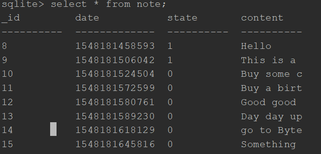
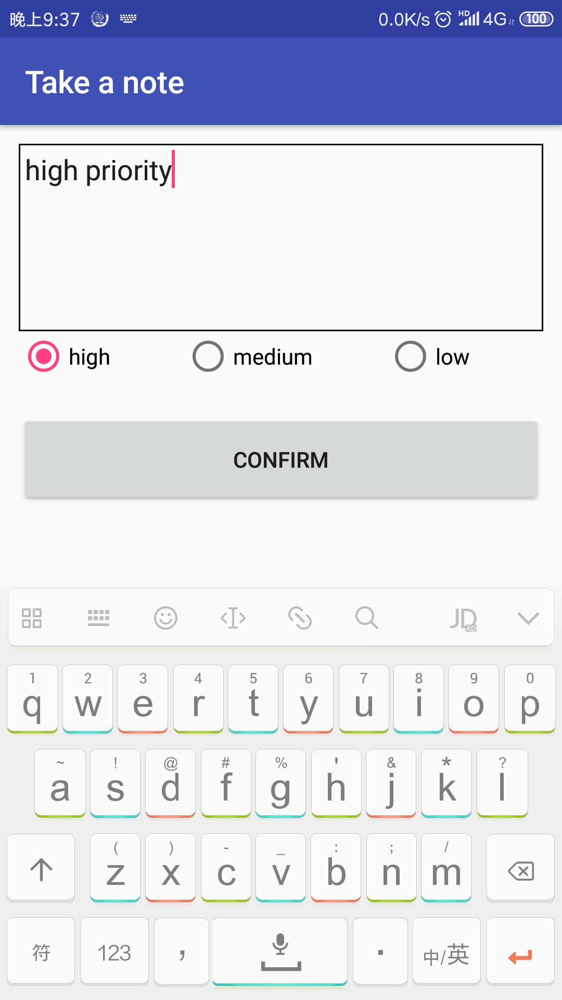
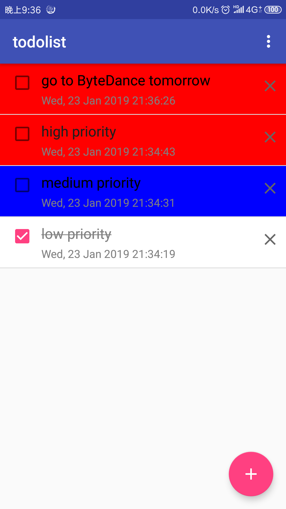
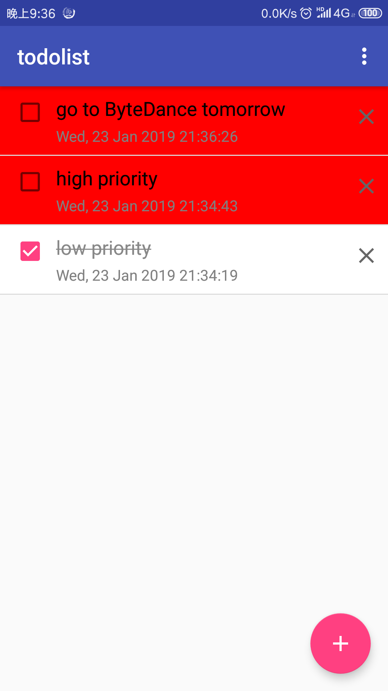
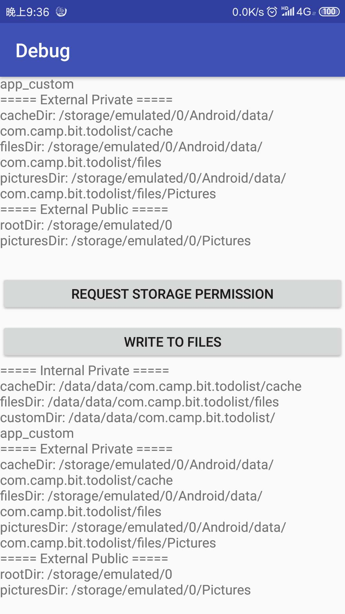

# chapter-5-storage

## 作业完成情况

#### 基础版要求

一个简单的Todo List App
* 为 To-do List 的场景建立一个数据库，完成数据
库表的设计和创建；

1. 通过sqlite3命令查看老师给的todo.db数据库中的表结构如下：



2. 在TodoContrast类中定义表结构和表的创建SQL如下：

```Java
public final class TodoContract {
    //定义表结构和 SQL 语句常量

    //create table sql
    public static final String SQL_CREATE_TABLE = "CREATE TABLE " + TodoEntry.TABLE_NAME +
            "(" + TodoEntry._ID + " INTEGER PRIMARY KEY AUTOINCREMENT," +
            TodoEntry.COLUMN_NAME_DATE + " INTEGER," +
            TodoEntry.COLUMN_NAME_STATE + " INTEGER," +
            TodoEntry.COLUMN_NAME_CONTENT + " TEXT"+ ")";

    public static final String SQL_DELETE_TABLE = "DROP TABLE IF EXISTS " + TodoEntry.TABLE_NAME;

    private TodoContract() {}

    public static class TodoEntry implements BaseColumns {
        //默认自带_id属性
        public static final String TABLE_NAME = "note";

        public static final String COLUMN_NAME_DATE = "date";
        public static final String COLUMN_NAME_STATE = "state";
        public static final String COLUMN_NAME_CONTENT = "content";
    }
}
```

3. 在TodoDbHelper中定义数据库名称、版本以及创建数据库
```java
    //定义数据库名、版本；创建数据库
    private static final int DATABASE_VERSION = 1;
    private static final String DATABASE_NAME = "todo.db";

    public TodoDbHelper(Context context) {
        super(context, DATABASE_NAME, null, DATABASE_VERSION);
    }

    @Override
    public void onCreate(SQLiteDatabase db) {
        //create table
        db.execSQL(TodoContract.SQL_CREATE_TABLE);
        Log.d(TAG, "onCreate: " + TodoContract.SQL_CREATE_TABLE);
    }
```

* 进入主页后，从数据库中查询出所有的数据，并
以列表形式呈现出来；

1. Sqlite数据库查询操作
```java
private List<Note> loadNotesFromDatabase() {
        // 从数据库中查询数据，并转换成 JavaBeans
        Log.d(TAG, "loadNotesFromDatabase");
        if (database == null) {
            return null;
        }
        String[] projection = {
                BaseColumns._ID,
                TodoEntry.COLUMN_NAME_DATE,
                TodoEntry.COLUMN_NAME_STATE,
                TodoEntry.COLUMN_NAME_CONTENT,
                TodoEntry.COLUMN_NAME_PRIORITY
        };
        String sortOrder = TodoEntry.COLUMN_NAME_PRIORITY + " DESC," +
                TodoEntry.COLUMN_NAME_DATE + " DESC";

        Cursor cursor = null;
        List<Note> notes = new ArrayList<>();
        try {
            cursor = database.query(
                    TodoEntry.TABLE_NAME,
                    projection,
                    null,
                    null,
                    null,
                    null,
                    sortOrder
            );
            while (cursor.moveToNext()) {
                long id = cursor.getLong(cursor.getColumnIndex(TodoEntry._ID));
                long date = cursor.getLong(cursor.getColumnIndex(TodoEntry.COLUMN_NAME_DATE));
                int state = cursor.getInt(cursor.getColumnIndex(TodoEntry.COLUMN_NAME_STATE));
                String content = cursor.getString(cursor.getColumnIndex(TodoEntry.COLUMN_NAME_CONTENT));
                int priority = cursor.getInt(cursor.getColumnIndex(TodoEntry.COLUMN_NAME_PRIORITY));

                Note note = new Note(id);
                note.setDate(new Date(date));
                note.setState(State.from(state));
                note.setContent(content);
                note.setPriority(Priority.from(priority));

                notes.add(note);
            }

        } finally {
            if (cursor != null) {
                cursor.close();
            }
        }
        return notes;
    }
```


* 点击加号后跳转到一个新页面，输入任意内容，
点击 CONFIRM 后把内容插入数据库中，返回
主页并更新主页数据；

1. 插入Sqlite数据库操作
```java
private boolean saveNote2Database(String content, Priority priority) {
        // 插入一条新数据，返回是否插入成功
        ContentValues values = new ContentValues();
        values.put(TodoContract.TodoEntry.COLUMN_NAME_DATE, new Date().getTime());
        values.put(TodoContract.TodoEntry.COLUMN_NAME_STATE, State.TODO.intValue);
        values.put(TodoContract.TodoEntry.COLUMN_NAME_CONTENT, content);
        values.put(TodoContract.TodoEntry.COLUMN_NAME_PRIORITY, priority.intValue);

        long rowId = database.insert(
                TodoContract.TodoEntry.TABLE_NAME,
                null,
                values
        );
        Log.d(TAG, "saveNote2Database: " + rowId);
        return rowId != -1;
    }
```


* 点击每个 note 前边的 checkbox 能把该条 note
置为“已完成”，并更新数据库和 UI；

1. 更新sqlite数据库，即设置状态为完成
```java
private void updateNode(Note note) {
        // 更新数据
        if (database == null) {
            return;
        }

        ContentValues values = new ContentValues();
        values.put(TodoEntry.COLUMN_NAME_STATE, note.getState().intValue);
        values.put(TodoEntry.COLUMN_NAME_DATE, note.getDate().getTime());
        values.put(TodoEntry.COLUMN_NAME_CONTENT, note.getContent());

        String selection = TodoEntry._ID + "= ?";
        String[] selectionArgs = {String.valueOf(note.id)};

        int count = database.update(
                TodoEntry.TABLE_NAME,
                values,
                selection,
                selectionArgs
        );

        Log.d(TAG, "updateNode:" + count);
        Log.d(TAG, "updateNode:" + note.toString());
    }
```

2. 更新UI：点击左侧checkbox，更新数据库的同时，将选中的一行Todo任务的文字添加删除线，并将设置文字颜色为灰色
```java
     checkBox.setOnCheckedChangeListener(new CompoundButton.OnCheckedChangeListener() {
            @Override
            public void onCheckedChanged(CompoundButton buttonView, boolean isChecked) {
                note.setState(isChecked ? State.DONE : State.TODO);
                operator.updateNote(note);

                //update UI, add delete line
                if (isChecked) {
                    contentText.setTextColor(Color.GRAY);
                    contentText.setPaintFlags(contentText.getPaintFlags() | Paint.STRIKE_THRU_TEXT_FLAG);
                } else {
                    contentText.setTextColor(Color.BLACK);
                    contentText.setPaintFlags(contentText.getPaintFlags() & ~Paint.STRIKE_THRU_TEXT_FLAG);
                }

                Log.d(TAG, "onCheckedChanged");
            }
        });
```
* 点击每个 note 后边的 x 能把该条 note 删除，
并更新数据库和 UI；

1. 点击note后面的X删除该条todo note,即执行sqlite数据库删除操作，使用主键_id删除
```java
  private void deleteNote(Note note) {
        // 删除数据
        if (database == null) {
            return;
        }
        String selection = TodoEntry._ID + "= ?";

        String[] selectionArgs = {String.valueOf(note.id)};

        int deletedRows = database.delete(
                TodoEntry.TABLE_NAME,
                selection, selectionArgs
        );

        Log.d(TAG, "deleteNote: " + deletedRows);
        Log.d(TAG, "deleteNote: " + note.toString());
        //update UI RecycleView
        notesAdapter.refresh(loadNotesFromDatabase());
    }
```

2.删除一条note后更新UI，即调用`notesAdapter.refresh(loadNotesFromDatabase());`重新查询数据库，然后刷新RecycleView


### 进阶版要求

* 在基础版的基础上增加“优先级”功能：
  * 升级原数据库，增加“优先级”字段；
  * 创建 note 时可以选择优先级；
  * 显示 note 时，不同的优先级背景色不一样，支持优先级越高的显示在越顶部；

1. 添加优先级字段，为integer类型，简单实现只加了三个优先级：高，中，低，分别对应 2,1,0，查询note的时候排序规则为先按优先级降序排序，优先级相同则按时间降序排序。为了方便，定义了`Priority`枚举类型。
```java
public enum Priority {
    HIGH(2), MEDIUM(1), LOW(0);

    public final int intValue;

    Priority(int intValue) {
        this.intValue = intValue;
    }

    public static Priority from(int intValue) {
        for (Priority priority : Priority.values()) {
            if (priority.intValue == intValue) {
                return priority;
            }
        }
        return LOW;
    }
}
```


2. 修改数据库版本为2, 修改数据库创建SQL，并实现`onUpgrade()`方法。
```java
    @Override
    public void onUpgrade(SQLiteDatabase db, int oldVersion, int newVersion) {
        for (int i = oldVersion; i < newVersion; i++) {
            switch (i) {
                case 1:
                    Log.d(TAG, "onUpgrade");
                    try {
                        db.execSQL("ALTER TABLE " + TodoContract.TodoEntry.TABLE_NAME +
                                " ADD " + TodoContract.TodoEntry.COLUMN_NAME_PRIORITY + " INTEGER DEFAULT 0");

                    } catch (Exception e) {
                        e.printStackTrace();
                    }
                    break;
                default:
                    break;
            }
        }
    }
```

3. 增加了一个字段，在数据库操作上进行了小幅的改动，如查询操作；在添加note的界面上添加了三个RadioButton控件，用于设置优先级。

<p align="center">
    
    <p align="center">
        <em>take a note</em>
    </p>
</p>

* 点击“WRITE TO FILES”时把一段文本写入某个存储目录下的文件里；再把这个文件的内容读出来，并显示在下方的TextView 里；

1. 练习文件的读写操作，将点击print absolute path按钮打印出来的内容写入文件test.txt，再读出显示在TextView。发现在app私有的internal和external目录，读写文件不需要申请权限，在外部公共目录读写文件，需要申请外部存储权限。练习代码如下：
```java
 fileWriteBtn.setOnClickListener(new View.OnClickListener() {
            @Override
            public void onClick(View v) {
                // 把一段文本写入某个存储区的文件中，再读出来，显示在 fileText 上
                String content = pathText.getText().toString();

                File filesDir = getFilesDir();
//                File filesDir = getExternalFilesDir(null);
//                File filesDir = Environment.getExternalStorageDirectory();
                try {
                    Log.d(TAG, "fileDirs: " + filesDir.getCanonicalPath());
                } catch (IOException e) {
                    e.printStackTrace();
                }

                File writeToFile = new File(filesDir, "test.txt");

                String[] contents = content.split("\n");

                //write text to (internal filesDir) test.txt
                FileWriter fileWriter = null;
                BufferedWriter bufferedWriter = null;
                try {
                    fileWriter = new FileWriter(writeToFile);
                    bufferedWriter = new BufferedWriter(fileWriter);

                    for (String c : contents) {
                        bufferedWriter.write(c);
                        bufferedWriter.newLine();
                    }
                } catch (IOException e) {
                    e.printStackTrace();
                } finally {
                    if (bufferedWriter != null) {
                        try {
                            bufferedWriter.close();
                        } catch (IOException e) {
                            e.printStackTrace();
                        }
                    }
                    if (fileWriter != null) {
                        try {
                            fileWriter.close();
                        } catch (IOException e) {
                            e.printStackTrace();
                        }
                    }
                }

                //read text from (internal filesDir) test.txt
                FileReader fileReader = null;
                BufferedReader bufferedReader = null;

                File readFromFile = new File(filesDir, "test.txt");
                String text = null;
                try {
                    fileReader = new FileReader(readFromFile);
                    bufferedReader = new BufferedReader(fileReader);
                    StringBuilder sb = new StringBuilder();
                    String line;
                    while ((line = bufferedReader.readLine()) != null) {
                        sb.append(line);
                        sb.append("\n");
                    }
                    text = sb.toString();
                } catch (IOException e) {
                    e.printStackTrace();
                } finally {
                    if (bufferedReader != null) {
                        try {
                            bufferedReader.close();
                        } catch (IOException e) {
                            e.printStackTrace();
                        }
                    }
                    if (fileReader != null) {
                        try {
                            fileReader.close();
                        } catch (IOException e) {
                            e.printStackTrace();
                        }
                    }
                }
                if (text != null) {
                    fileText.setText(text);
                } else {
                    fileText.setText("fail in writing file or reading file");
                }
            }
        });
```


**最终完成的基础版+进阶版todo list app如下所示：**

<p align="center">
    
    <p align="center">
        <em>take a note</em>
    </p>
</p>

<p align="center">
    
    <p align="center">
        <em>show note</em>
    </p>
</p>

<p align="center">
    
    <p align="center">
        <em>done note</em>
    </p>
</p>

<p align="center">
    
    <p align="center">
        <em>write to file</em>
    </p>
</p>
